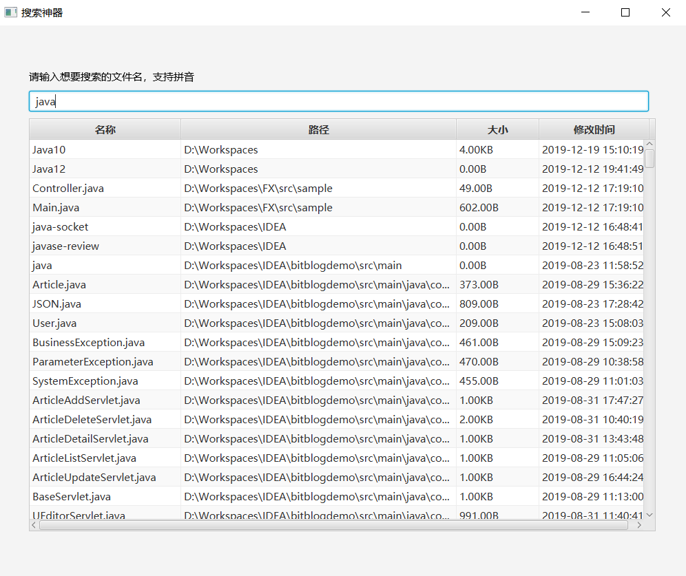
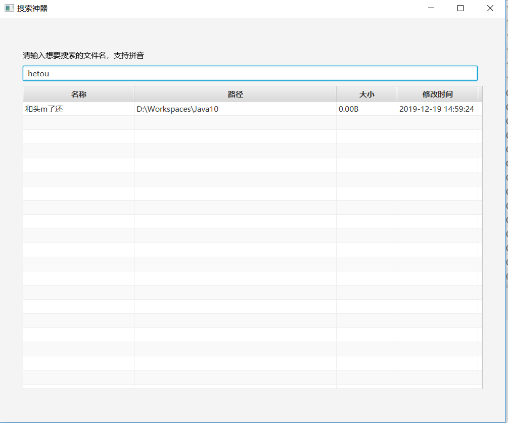
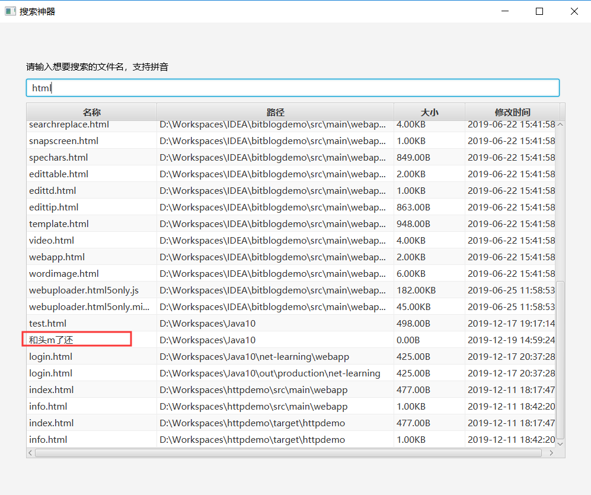
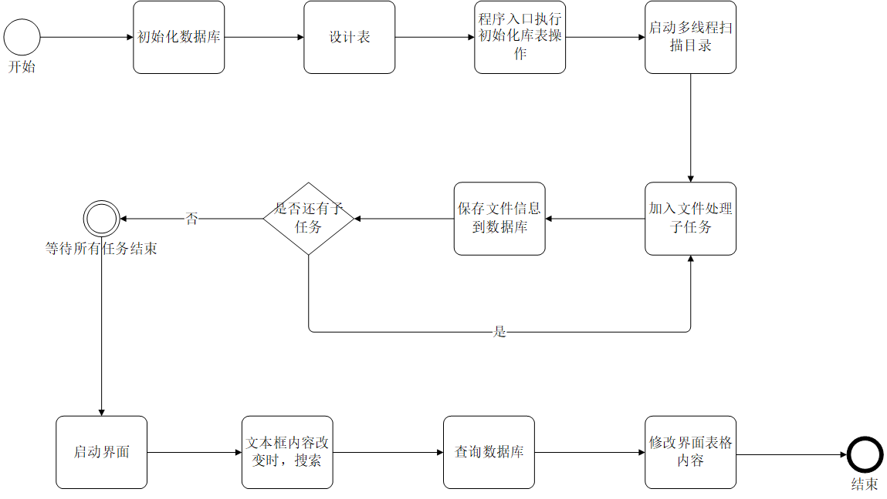

# 文件搜索项目说明

## 本节目标

> - 

## 项目介绍

在windows下有[Everything](https://www.voidtools.com/zh-cn/)等搜索工具，可以根据文件名快速定位本地磁盘文件。


要实现类似的主要功能，如下：


可以根据文件名搜索，只要包含输入的字段，就显示：



如果文件名是汉字，能够提供拼音的支持：



拼音可以只输入首字母：



## 系统设计

### 遍历文件信息

每次搜索时再进行本地文件遍历的话，性能和效率比较低，操作体验比较差。为提高搜索效率，以提高用户的使用体验，可以考虑在启动时扫描系统目录，将文件信息保存起来。需要考虑以下问题：

+ 遍历本地文件是比较耗时的操作，如何提高效率？
+ 考虑多线程来遍历文件，每个文件需要保存信息，为以后扩展性考虑，保存信息这个步骤如何设计能够更好扩展，也就是说，如何设计，在以后替换成其他实现是比较方便的？
+ 如何保证多线程遍历完，并执行保存文件信息之后，关闭线程池，并打开搜索界面？

### 保存文件信息

需要保存的文件基本信息，包括文件名，路径，文件大小，上次修改时间。为了满足对拼音的支持，还需要保存中文汉语拼音。所以需要考虑以下几点

+ 保存的信息放在哪？需要考虑将项目打包给别人使用时的便捷性
+ 汉字对拼音的支持，如何转换？
+ 汉语拼音存在多音字的情况，每一个汉字都可能是多个汉语拼音，这样的情况下，一个文件名转换为汉语拼音时，就可能有多种可能。如何转换为所有可能的拼音组合？
+ 对首字母拼音也需要支持，还需要考虑每个汉字取首字母的情况
+ 保存的信息如何设计？

### 文件搜索

进行文件搜索，需要使用javafx界面来进行客户端UI界面开发，需要考虑以下问题：

+ 文件信息展示时，是根据保存时的信息获取来的，需要考虑字段的类型转换？文件大小和上次修改时间，如何转换方便存储，也方便显示

### 流程如下：



## 开发步骤

### 创建Maven项目

在pom.xml中引入依赖包，及配置编译版本：

```xml
<?xml version="1.0" encoding="UTF-8"?>
<project xmlns="http://maven.apache.org/POM/4.0.0"
         xmlns:xsi="http://www.w3.org/2001/XMLSchema-instance"
         xsi:schemaLocation="http://maven.apache.org/POM/4.0.0 http://maven.apache.org/xsd/maven-4.0.0.xsd">
    <modelVersion>4.0.0</modelVersion>

    <groupId>frank</groupId>
    <artifactId>mysearcher</artifactId>
    <version>1.0-SNAPSHOT</version>

    <dependencies>
        <dependency>
            <groupId>com.belerweb</groupId>
            <artifactId>pinyin4j</artifactId>
            <version>2.5.1</version>
        </dependency>
        <dependency>
            <groupId>org.xerial</groupId>
            <artifactId>sqlite-jdbc</artifactId>
            <version>3.28.0</version>
        </dependency>
    </dependencies>

    <build>
        <plugins>
            <plugin>
                <artifactId>maven-compiler-plugin</artifactId>
                <version>3.8.1</version>
                <configuration>
                    <source>1.8</source>
                    <target>1.8</target>
                    <encoding>UTF-8</encoding>
                </configuration>
            </plugin>
            <plugin>
                <artifactId>maven-jar-plugin</artifactId>
                <version>3.1.0</version>
                <configuration>
                    <archive>
                        <manifest>
                            <mainClass>Main</mainClass> <!-- 指定入口类 -->
                            <addClasspath>true</addClasspath> <!-- 在jar的MF文件中生成classpath属性 -->
                            <classpathPrefix>lib/</classpathPrefix> <!-- classpath前缀,即依赖jar包的路径 -->
                        </manifest>
                    </archive>
                </configuration>
            </plugin>
            <plugin>
                <artifactId>maven-dependency-plugin</artifactId>
                <version>3.1.1</version>
                <executions>
                    <execution>
                        <id>copy</id>
                        <phase>package</phase>
                        <goals>
                            <goal>copy-dependencies</goal>
                        </goals>
                        <configuration>
                            <!-- 指定依赖包的输出路径，需与上方的classpathPrefix保持一致 -->
                            <outputDirectory>${project.build.directory}/lib</outputDirectory>
                        </configuration>
                    </execution>
                </executions>
            </plugin>
        </plugins>
    </build>
    
</project>
```

### 设计数据库和表

需要保存文件基本信息（名称、路径、大小、上次修改时间），如果包含汉字时，还需要保存汉语拼音，汉语拼音可能有多个，与基本信息为多对1的关系：

```sql
-- 文件信息表
DROP TABLE IF EXISTS file_meta;
CREATE TABLE IF NOT EXISTS file_meta (
    id INTEGER PRIMARY KEY AUTOINCREMENT,
    name VARCHAR(50) NOT NULL,
    path VARCHAR(1000) NOT NULL,
    size BIGINT NOT NULL,
    last_modified TIMESTAMP NOT NULL
);

-- 文件拼音表
DROP TABLE IF EXISTS file_pinyin;
CREATE TABLE IF NOT EXISTS file_pinyin(
    id INTEGER PRIMARY KEY AUTOINCREMENT,
    value VARCHAR(50) NOT NULL,
    file_meta_id INTEGER,
    FOREIGN KEY (file_meta_id) REFERENCES file_meta(id)
);
```

### 设计数据库工具类，及表初始化操作

+ 考虑便捷性及空间占用情况，考虑使用内存数据库，很多内存数据库也是关系型的，支持sql以及事务等。我们这里使用SQLite，比较小。和MySQL使用JDBC的参数不同，SQLite会生成本地一个数据库文件，需要指定该文件路径，URL格式为：jdbc:sqlite://数据库文件路径，没有用户名密码。

+ 工具类提供数据库连接，及释放数据库资源功能，和MySQL中使用JDBC类似。

+ 初始化sql语句，需要使用IO文件流进行读取，需要考虑sql注释的情况。

### 设计汉语拼音工具

+ 使用第三方库提供的汉字到拼音的转换，一个汉字转换出来可能有多个拼音。

  配置汉字的字符范围，及拼音的输出格式（小写、不带音调、包含V字符）

  ```java
  /**
   * 中文字符格式
   */
  private static final String CHINESE_PATTERN = "[\\u4E00-\\u9FA5]";
  
  /**
   * 拼音输出格式
   */
  private static final HanyuPinyinOutputFormat PINYIN_OUTPUT_FORMAT;
  
  static{
      PINYIN_OUTPUT_FORMAT = new HanyuPinyinOutputFormat();
  
      // 输出小写
      PINYIN_OUTPUT_FORMAT.setCaseType(HanyuPinyinCaseType.LOWERCASE);
      // 不带音调
      PINYIN_OUTPUT_FORMAT.setToneType(HanyuPinyinToneType.WITHOUT_TONE);
      // 包含字符v
      PINYIN_OUTPUT_FORMAT.setVCharType(HanyuPinyinVCharType.WITH_V);
  }
  ```

  API有提供单个字符的拼音转换：

  ```java
  String[] temp = PinyinHelper.toHanyuPinyinStringArray(c, PINYIN_OUTPUT_FORMAT);
  ```

+ 多个字符组成的文件名，需要自行按照排列组合的不同字符串进行拼接。拼音分全拼，和汉字首字母拼接的两种方式

### 设计多线程扫描任务及文件信息保存

+ 多线程执行大量任务，使用线程池来提高执行效率
+ 为便于在线程中执行的任务有较好的扩展性，可以考虑使用接口回调的方式实现。传入时设定为文件信息保存的任务。
+ 在线程执行时，待执行任务数+1， 执行完后，待执行任务数-1，开启子任务时，每个子任务都执行任务数+1操作，这样在最后可以判断出是否所有线程执行完毕。

### 设计界面及文件信息搜索

创建javafx界面文件

（1）Main.java

```java
public class Main extends Application {

    @Override
    public void start(Stage primaryStage) throws Exception{
        Parent root = FXMLLoader.load(getClass().getClassLoader().getResource("app.fxml"));
        primaryStage.setTitle("搜索神器");
        primaryStage.setScene(new Scene(root, 1000, 800));
        primaryStage.show();
    }
    public static void main(String[] args) {
        launch(args);
    }
}
```

（2）app.fxml

```xml
<?xml version="1.0" encoding="UTF-8"?>

<?import javafx.geometry.*?>
<?import javafx.scene.layout.*?>
<?import javafx.scene.control.*?>
<?import javafx.scene.control.cell.*?>

<GridPane fx:id="rootPane" alignment="center" hgap="10" vgap="10" xmlns:fx="http://javafx.com/fxml/1" xmlns="http://javafx.com/javafx/8" fx:controller="app.Controller">
   <children>
   
       <Button onMouseClicked="#choose" prefWidth="90" text="选择目录" GridPane.columnIndex="0" GridPane.rowIndex="0" />
       <Label fx:id="srcDirectory">
         <GridPane.margin>
            <Insets left="100.0" />
         </GridPane.margin>
      </Label>
       <TextField fx:id="searchField" prefWidth="900" GridPane.columnIndex="0" GridPane.rowIndex="1" />
   
       <TableView fx:id="fileTable" prefHeight="700" prefWidth="900" GridPane.columnIndex="0" GridPane.columnSpan="2" GridPane.rowIndex="2">
           <columns>
               <TableColumn fx:id="nameColumn" prefWidth="220" text="名称">
                   <cellValueFactory>
                       <PropertyValueFactory property="name" />
                   </cellValueFactory>
               </TableColumn>
               <TableColumn prefWidth="400" text="路径">
                   <cellValueFactory>
                       <PropertyValueFactory property="path" />
                   </cellValueFactory>
               </TableColumn>
               <TableColumn fx:id="sizeColumn" prefWidth="120" text="大小">
                   <cellValueFactory>
                       <PropertyValueFactory property="sizeText" />
                   </cellValueFactory>
               </TableColumn>
               <TableColumn fx:id="lastModifiedColumn" prefWidth="160" text="修改时间">
                   <cellValueFactory>
                       <PropertyValueFactory property="lastModifiedText" />
                   </cellValueFactory>
               </TableColumn>
           </columns>
       </TableView>
   </children>
</GridPane>

```

（3）Controller

```java
public class Controller implements Initializable {

    @FXML
    private GridPane rootPane;

    @FXML
    private TextField searchField;

    @FXML
    private TableView<FileMeta> fileTable;

    @FXML
    private Label srcDirectory;

    public void initialize(URL location, ResourceBundle resources) {
        // 添加搜索框监听器，内容改变时执行监听事件
        searchField.textProperty().addListener(new ChangeListener<String>() {

            public void changed(ObservableValue<? extends String> observable, String oldValue, String newValue) {
                freshTable();
            }
        });
    }

    public void choose(Event event) {
        // 选择文件目录
        DirectoryChooser directoryChooser=new DirectoryChooser();
        Window window = (Stage) rootPane.getScene().getWindow();
        File file = directoryChooser.showDialog(window);
        // 获取选择的目录路径，并显示
        String path = file.getPath();
        // TODO
    }

    // 刷新表格数据
    private void freshTable(){
        ObservableList<FileMeta> metas = fileTable.getItems();
        metas.clear();
        // TODO
    }

}
```

